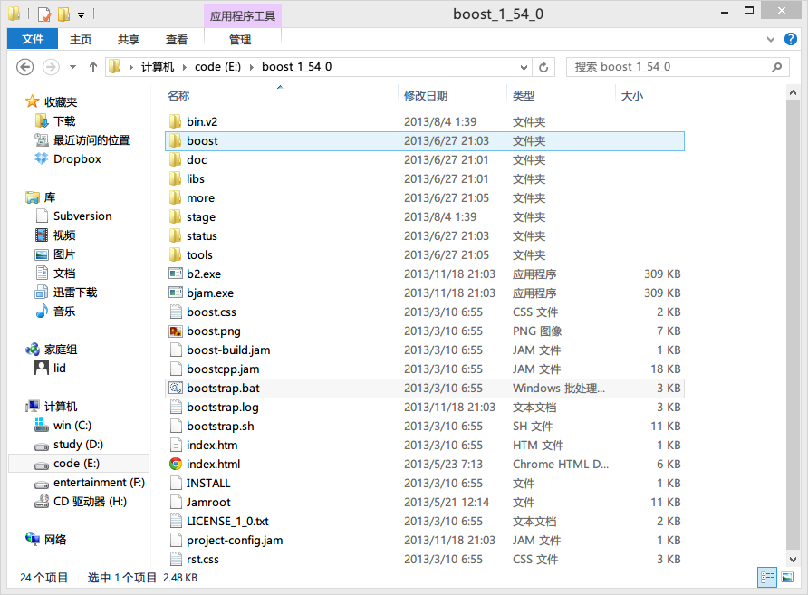
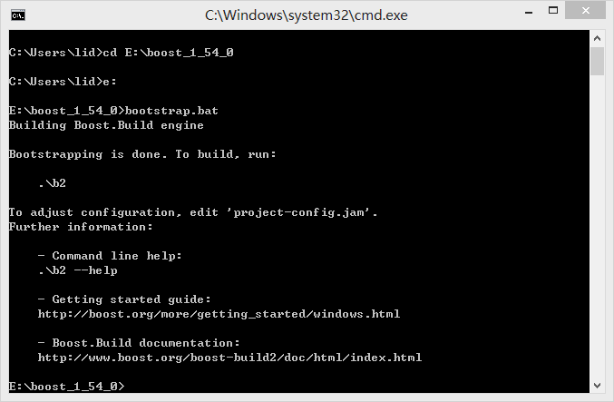
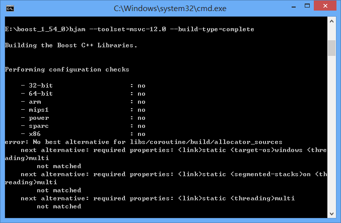
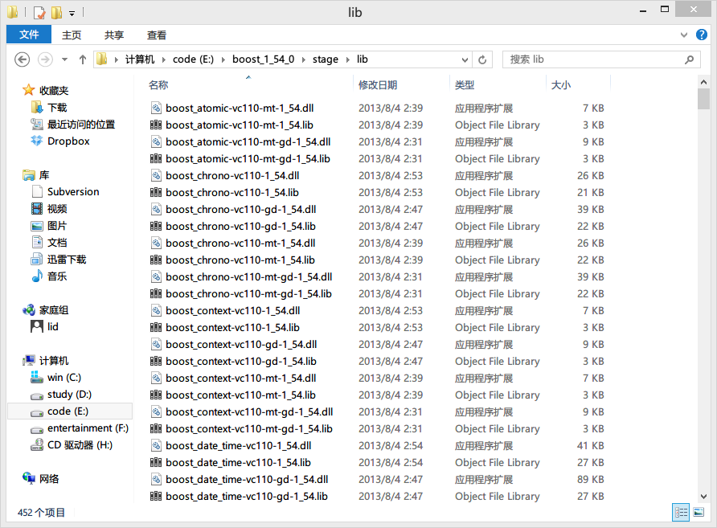
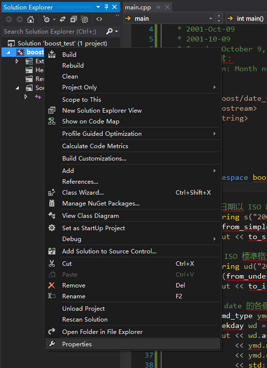
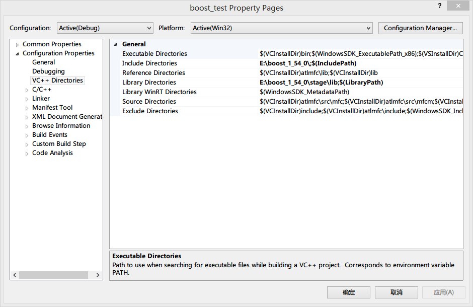
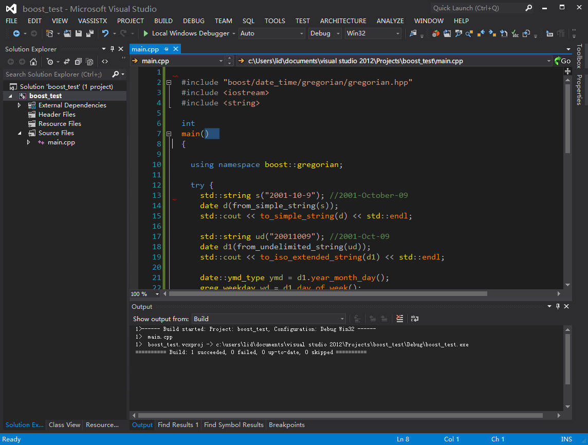

# 1. Boost 环境搭建

我们要研究Boost的源码，最重要的就是建立调试环境，只有亲自调试，亲自体会代码执行的每一行，对代码才能有充分的理解。

这位看官说了，看源码不行吗？不是有一句话说
”源码之前，了无秘密“吗？

额~~~ 这个童鞋哪来的，我一头汗，光看源码。

行，这当然行啦，但我水平有限，没有侯大大那么牛，所以我这等菜鸟，只有建立调试环境来辅助分析。

## Boost 安装

总体来说，直接去Boost官网把代码下载下来就好啦，请注意噢，本书用的版本是1.54

[Go To Boost][1]

## 选择一个趁手的IDE

我还没说话，这位看官又说了 “Boost是高手写的代码，看高手写的代码，就应该用vi + ctags来看，不需要用鼠标，一切都依靠键盘上灵巧的手，这简直就是艺术，当然还有emacs，我们首先来讨论下是使用vi还是emacs吧”。

我看出来了，这位看官绝对是砸场子的，唉，但没办法啊，在座都是我的衣食父母，于是我换上谄媚的笑说道：

“大爷，得，您行家，
您老待着在，我不敢现眼了，您里面请，小二，高碎侍候～～～”

像我们这些菜鸟，我们还是选择点靠谱的。

世上有万万千千的IDE，这里我们介绍2种

- linux平台: Eclipse
- windows平台: Visual Studio C++ Express

## Visual Studio C++ Express
为什么选择 Express版本的呢，因为没钱，码农穷啊，说起来都是泪，当然如果你有pro版，team版更好（需要花银子的噢）

### 编译Boost

首先解压Boost源码到一个目录，我这里是 `E:\boost_1_54_0`

图1.1 boost安装目录

Win+R 输入cmd进入控制台，进入boost文件目录执行 `bootstrap.bat`脚本

如果成功，则在boost目录下生成`bjam.exe`

图1.2 执行bootstrap.bat

控制台不要退出，直接执行`bjam --toolset=msvc-12.0 --build-type=complete`命令，

这个命令的意思是，使用Visual Studio C++ 2012 Express编译boost

如果看官的Visual Studio C++ Express版本和我的不一致，改成对应的版本即可。

这个编译需要很长时间，看官可以准备一部电影看看。

图1.3 编译boost

漫长的等待之后，我们在stage/lib目录下发现boost已经编译好了

图1.4 boost编译成功，产生输出文件

编译成功后，我们配置Visual Studio C++ Express路径，当然在之前你得新建一个工程，然后随便摘抄一点代码，比如

	#include "boost/date_time/gregorian/gregorian.hpp"
	#include <iostream>
	#include <string>

	int main() 
	{
		using namespace boost::gregorian;

		try {
			std::string s("2001-10-9"); //2001-October-09
			date d(from_simple_string(s));
			std::cout << to_simple_string(d) << std::endl;

			std::string ud("20011009"); //2001-Oct-09
			date d1(from_undelimited_string(ud));
			std::cout << to_iso_extended_string(d1) << std::endl;

			date::ymd_type ymd = d1.year_month_day();
			greg_weekday wd = d1.day_of_week();
			std::cout << wd.as_long_string() << " "
				<< ymd.month.as_long_string() << " "
				<< ymd.day << ", " << ymd.year
				<< std::endl;

			std::string bad_date("20012509"); //2001-??-09
			std::cout << "An expected exception is next: " << std::endl;
			date wont_construct(from_undelimited_string(bad_date));
			//use wont_construct so compiler doesn't complain, but you wont get here!
			std::cout << "oh oh, you shouldn't reach this line: " 
				<< to_iso_string(wont_construct) << std::endl;
		}
		catch(std::exception& e) {
			std::cout << "  Exception: " <<  e.what() << std::endl;
		}

		return 0;
	}

然后配置文件目录，下面是我的配置，看官可以参考一下

图1.5 选择项目属性

图1.6 项目目录配置

最后我们编译一下：

图1.7 编译测试代码成功

## Eclipse

另一位看官拍桌子了，气冲冲的说道：“Windows上面也可以用eclipse啊，安装jdk，安装cygwin或者mingw，配置一下环境变量，不就OK了吗？”

是的，上面这位行家说的很对，我没接这一茬，继续说道，如果你想追求IDE环境的一致，那么Eclipse是不二的选择，但如果图个方便，
windows平台下还是 Visual Studio C++ Express的好，而且我下面的要说的书，还是以Visual Studio C++为主，说完这番话，我偷抹了
一把汗，匆忙下场了。

## links
  * [目录](<preface.md>)
  * 下一节: [Go安装](<01.1.md>)

  [1]: http://www.boost.org/
