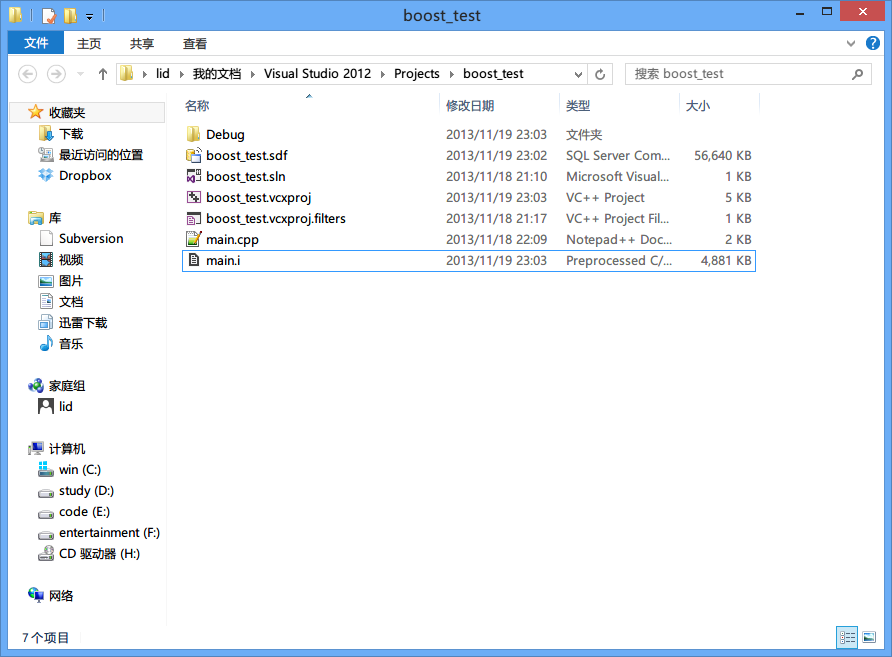

# 1.2 中间文件

很早以前，黑暗森林魔法界有一本很古老的魔法书叫《编译原理》，里面介绍了所有魔法的执行过程。
如今这本书传遍各个大陆，当年我也拜读过，虽然现在全忘了，哈哈。

但我还依稀记得编译流程分为了四个步骤，分别为：
- 预处理（Pre-Processing）
- 编译（Compiling）
- 汇编（Assembling）
- 链接（Linking）

一个看官问：“《编译原理》这本书和Boost源码有什么直接关系吗？” 

听到这话，我内心不禁暗笑，面上确不露声色，一本正经的说道：“且听我慢慢道来。”

众所周知，Boost的代码晦涩难懂，比如如下代码：

    #define BOOST_BIND_OPERATOR( op, name ) \
    \
    struct name \
    { \
        template<class V, class W> bool operator()(V const & v, W const & w) const { return v op w; } \
    }; \
     \
    template<class R, class F, class L, class A2> \
        bind_t< bool, name, list2< bind_t<R, F, L>, typename add_value<A2>::type > > \
        operator op (bind_t<R, F, L> const & f, A2 a2) \
    { \
        typedef typename add_value<A2>::type B2; \
        typedef list2< bind_t<R, F, L>, B2> list_type; \
        return bind_t<bool, name, list_type> ( name(), list_type(f, a2) ); \
    }
  
再比如：

    int main()
    {
        std::string hello( "Hello, world!" );
        BOOST_FOREACH( char ch, hello )
        {
            std::cout << ch;
        }
        return 0;
    }
  
由于Boost使用了很多很多的宏，使得我们调试产生了很大的麻烦，宏是没法调的，这样我们就没发监测每一步到底发生了什么。
使用起来虽然特别爽，但想搞清楚原理，简直太困难了。

如果有个东西，能把宏全部展开成实际代码，这样我们再调试，岂不是就完美了？
对，这就是我们伟大的编译器。想想看我们写的代码，不管嵌套了多少的宏，嵌套了多少的逻辑，编译器都能生成最后的代码。

那我们怎么依靠编译器不产生最后代码，只产生中间代码呢？

## Visual Stduio C++

很简单，只要附加一个命令就可以啦。
路径是：`项目右键 --> Properties --> C/C++ --> Command Line --> Additional Options` 加上`/P` 即可，看官如果不清楚，
这里有图参考

图1.2.1 Visual Stduio C++ 配置

编译后，编译器会产生一个*.i的文件

图1.2.2 i文件

这个文件就是**中间文件**，它很重要，实际上它把所有的代码都整合到一起去了，包括宏展开等内容，这样的文件
能帮助我们更好的分析Boost，分析一些复杂代码。

图1.2.2 i文件内容

## Eclipse

## links
  * [目录](<00.00.目录.md>)
  * 上一节: [Boost安装](<01.01.Boost安装.md>)
  * 下一节: [小结](<01.03.小结.md>)
